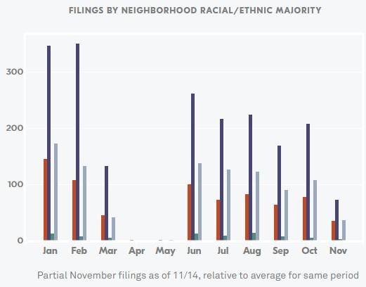
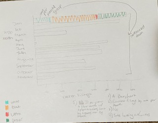

# Assignment 3 & 4 

# Examination of Racial Disparities in Cleveland Evictions (2020)

For this assignment, I located the following image from the Eviction Lab, based out of Princeton University.  

As you can see in the image, the data shows the number of eviction filings by racial makeup in 2020 so far.  As someone who is very interested in housing and eviction policy, I wanted to take a deeper look at a city I love.  I lived in Cleveland for three years where I taught K-12 before coming to Heinz.  There are a number of racial challenges in the city of Cleveland, and, as this data is trying to show, evictions is one of them.  

My original thoughts after looking at the data shown in this original visualization were that there was almost too much going on.  The story that the data was presenting was a stark and serious example of racial bias in public policy and the dozens of bars on this chart were taking away from that message.  To address these concerns, I knew, off the bat, that I wanted to address the amount of items on the chart and try to minimize space used to really hone in on the story.  

After a quick sketch, this is what I came up with as sort of a rough draft to see if my ideas were making sense to a larger audience.  One of the key things I wanted to do was expand the amount of peoople that were able to understand the racial divide here.  

